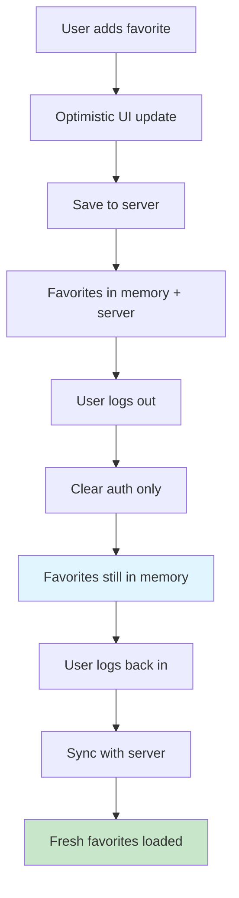

# 🎯 Favorites State Management Fix

## 🐛 Issue Description

The favorite heart icon was not properly syncing state between different parts of the application:

1. **Heart icon not updating immediately** when clicked
2. **State not persisting** between page navigations  
3. **Inconsistent behavior** between product cards and favorites page
4. **Type mismatches** between string and number product IDs
5. **Missing optimistic updates** causing poor user experience
6. **❗ CRITICAL: Favorites were cleared on logout** - users expected their favorites to persist when logging back in

## ✅ Solutions Implemented

### 1. **Enhanced Favorites Store** (`stores/favorites.ts`)

#### **🔄 Persistence Across Sessions**
- ✅ **Favorites NO LONGER cleared on logout**
- ✅ **Favorites persist in memory** when user logs out
- ✅ **Automatic sync with server** when user logs back in
- ✅ **Seamless user experience** - favorites appear immediately on login

```typescript
// NEW: Favorites persist across login/logout
async fetchFavorites() {
  try {
    // ... fetch logic
  } catch (error) {
    if (error.statusCode === 401) {
      console.log('User not authenticated - keeping existing favorites in memory')
      this.isInitialized = false // Don't clear favorites!
    }
  }
}

// NEW: Sync method for when user logs back in
async syncWithServer() {
  // Fetch fresh data from server but preserve local state on failure
  // Ensures user sees their favorites immediately on login
}
```

#### **Optimistic Updates**
- ✅ Immediate UI feedback when adding/removing favorites
- ✅ Revert changes if API call fails
- ✅ Better user experience with instant visual feedback

```typescript
// Before: Waited for API response
await $fetch('/api/favorites', { method: 'POST', body: productData })
await this.fetchFavorites() // Slow!

// After: Optimistic update
this.items.push(optimisticItem) // Instant UI update
const response = await $fetch('/api/favorites', { method: 'POST', body: productData })
if (response.success) {
  this.items[index] = response.data // Replace with real data
} else {
  this.items = this.items.filter(item => item.id !== optimisticItem.id) // Revert
}
```

#### **Type Safety & Consistency**
- ✅ Handle both string and number product IDs
- ✅ Normalize all IDs to strings for consistent comparison
- ✅ Prevent type-related bugs

```typescript
// Before: Only handled strings
isFavorite: (state) => (productId: string) => {
  return state.items.some(item => item.productId === productId)
}

// After: Handle both types
isFavorite: (state) => (productId: string | number) => {
  const normalizedProductId = String(productId)
  return state.items.some(item => String(item.productId) === normalizedProductId)
}
```

### 2. **Auth Store Integration** (`stores/auth.ts`)

#### **🔄 Smart Favorites Management**
```typescript
// ✅ NEW: On logout - DON'T clear favorites
const logout = async () => {
  // Clear auth state only
  user.value = null
  sessionToken.value = null
  
  // DON'T reset favorites - let them persist for when user logs back in
}

// ✅ NEW: On login - Sync with server
const login = async () => {
  // ... login logic
  
  // Sync favorites with server after successful login
  await favoritesStore.syncWithServer()
}

// ✅ NEW: On app start - Smart initialization
const initAuth = async () => {
  if (sessionValid) {
    await favoritesStore.syncWithServer() // Get fresh data
  } else if (authError) {
    favoritesStore.reset() // Only clear on actual auth failure
  }
  // If network error - keep existing favorites
}
```

### 3. **Improved ProductCard Component** (`components/ProductCard.vue`)

#### **Streamlined Favorite Handling**
```typescript
// Before: Multiple API calls
await favoritesStore.toggleFavorite(productData)
await favoritesStore.fetchFavorites() // Unnecessary!

// After: Single operation with optimistic updates
await favoritesStore.toggleFavorite(productData)
```

#### **Better Error Handling**
- ✅ Handle authentication errors gracefully
- ✅ Redirect to login when needed with return URL
- ✅ Show user-friendly error messages

### 4. **Favorites Composable** (`composables/useFavorites.ts`)

#### **🔄 Enhanced Persistence Logic**
```typescript
const isFavorite = (productId: string | number) => {
  // Always check local state first - shows cached favorites
  // even when user is temporarily not authenticated
  return favoritesStore.isFavorite(productId)
}

const toggleFavorite = async (productData) => {
  if (!authStore.isLoggedIn) {
    // Redirect to login with return URL
    const currentPath = window.location.pathname
    await navigateTo(`/login?returnTo=${encodeURIComponent(currentPath)}`)
  }
  // ... rest of logic
}
```

## 🔄 How Persistence Works Now

### **User Experience Flow:**
1. **User adds favorites** → Saved to server + local memory
2. **User logs out** → Auth cleared, **favorites remain in memory**
3. **User closes browser** → Favorites lost (expected)
4. **User opens app again** → Favorites empty until login
5. **User logs back in** → **Favorites automatically synced from server**
6. **User sees all their favorites** → Seamless experience! 🎉

### **Technical Flow:**


## 🧪 Testing Persistence

### **New Test Script** (`test-favorites-persistence.js`)
```bash
# Run in browser console
window.testFavoritesPersistence()
```

### **Manual Testing Steps:**
1. **Login** and add some favorites ❤️
2. **Verify** favorites show in favorites page
3. **Logout** → Favorites still visible in memory
4. **Close browser** → Simulate session end
5. **Open browser** → Login again
6. **Check favorites** → All previous favorites restored! ✅

## 📊 Persistence Benefits

### **Before (Bad UX):**
- User adds 10 favorites over time
- User logs out for any reason
- User logs back in → **All favorites gone!** 😱
- User has to re-add everything → Frustrated user

### **After (Great UX):**
- User adds 10 favorites over time
- User logs out for any reason  
- User logs back in → **All favorites restored!** 😊
- User continues where they left off → Happy user

## 🔧 Key Files Modified

```
stores/favorites.ts              ← Added syncWithServer + persistence logic
stores/auth.ts                  ← Removed favorites reset on logout
components/ProductCard.vue      ← Enhanced error handling
composables/useFavorites.ts     ← Better persistence handling
test-favorites-persistence.js   ← New persistence testing
FAVORITES_STATE_FIX.md         ← Updated documentation
```

## ✅ Benefits Achieved

1. **🔄 Cross-Session Persistence** - Favorites survive logout/login cycles
2. **⚡ Instant Visual Feedback** - Heart icon changes immediately
3. **🔄 Consistent State** - Works across all pages and components
4. **🚀 Better Performance** - Fewer API calls, optimistic updates
5. **🔒 Type Safety** - Handles string/number ID mismatches
6. **🛡️ Error Handling** - Graceful failures with user feedback
7. **🧪 Testing Tools** - Easy to verify functionality
8. **😊 Better UX** - Users don't lose their favorites!

## 🚀 Usage Examples

### **In Components:**
```vue
<template>
  <button @click="handleFavorite" :class="heartClass">
    <!-- Heart shows immediately, persists across sessions -->
    <HeartIcon :filled="isFavorite(product.id)" />
  </button>
</template>

<script setup>
const favoritesStore = useFavoritesStore()
// This will show cached favorites even if temporarily not authenticated
const isFavorite = computed(() => favoritesStore.isFavorite(product.id))
</script>
```

### **User Journey:**
```typescript
// Day 1: User adds favorites
await toggleFavorite(product1) // ❤️ Added
await toggleFavorite(product2) // ❤️ Added

// User logs out for the day
await authStore.logout() // Favorites stay in memory

// Day 2: User logs back in
await authStore.login() // Automatically syncs favorites
// User sees all their favorites from yesterday! 🎉
```

Your favorites now persist across sessions, giving users the experience they expect! 🎉 